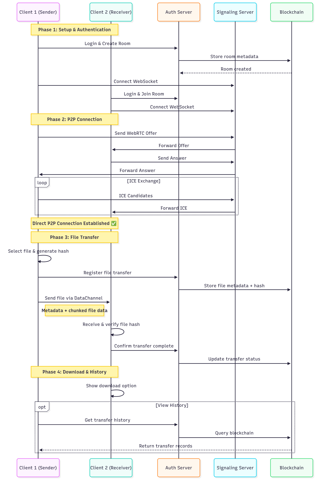

# SecureShare: Spring Boot WebRTC-P2P File Transfer

## Overview

A Spring Boot–based application enabling peer-to-peer file sharing using WebRTC (`RTCDataChannel`) between clients. Authentication is managed via HTTP cookies or authorization headers, while file metadata and history are immutably recorded on a blockchain to enhance security and traceability.

### Key Features

* **Peer-to-peer file transfer**: Utilizes WebRTC’s `RTCDataChannel` for direct client-to-client file sharing, bypassing centralized storage.

* **Chunked file transfer**: Files are sliced into smaller chunks (ideally <1200 bytes) to fit MTU limits and prevent drops; optionally grouped into blocks for efficiency.

* **Authentication & Authorization**:

  * HTTP Cookie-based authentication (e.g., session or JWT in a cookie).
  * Support for authorization via HTTP headers (e.g., `Authorization: Bearer <token>`).
* **Immutable metadata tracking**: File metadata and transfer history are logged on a blockchain (e.g., via smart contracts), providing an auditable, tamper-proof trail.
* **Security enhancements**:

  * Secure key exchange with DTLS-SRTP, and certificate fingerprinting to avoid eavesdropping or MITM attacks.

## Architecture

Here's a high-level flow diagram:

* **Clients(React App)**: 
   * Establish WebRTC connections via the server for signaling.
   * collect the file metadata and transfer history on the blockchain.

* **Backend**:

  * Handles login/auth via cookies or headers.
  * Coordinates signaling (offer/answer, ICE exchanges).
* **Blockchain**: Stores metadata hashes (e.g., file name, size, timestamp, sender/receiver, etc.) using a ledger or smart-contract system for immutability and auditability.

## Usage

1. **Login/Register**

   * Access `/login` to authenticate (via cookie or receive JWT token).

2. **Signaling Endpoint**

   * Use WebSocket endpoint `/ws/signaling` to exchange WebRTC offers, answers, and ICE candidates.

3. **WebRTC Data Transfer**

   * After signaling, clients create an `RTCDataChannel`.
   * Slice the file into chunks (<1200 bytes each) to avoid drops.
   * Optionally group chunks into blocks for better flow control.

4. **Blockchain Recording**

   * Once the file transfer begins or completes, log metadata (e.g., file hash, participants, timestamp) to the blockchain ledger for an immutable audit.

## Blockchain Integration

* Use a permissioned blockchain (e.g., Hyperledger Fabric) or public blockchain.
* Record metadata: file ID, sender/receiver, timestamp, hashes.
* Use smart contracts to store or validate metadata — enhancing provenance tracking.
* Blockchain ensures tamper-proof storage and verifiable history of file transfers.

